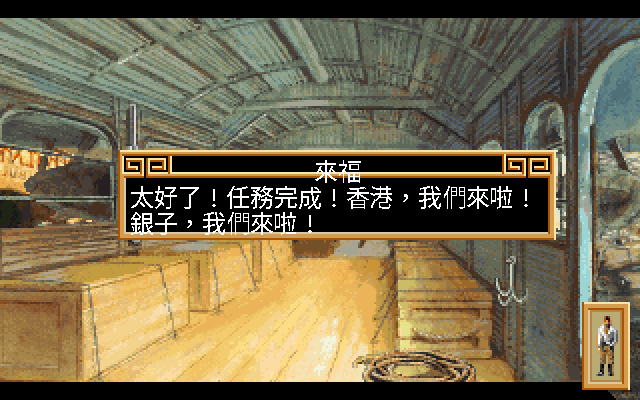
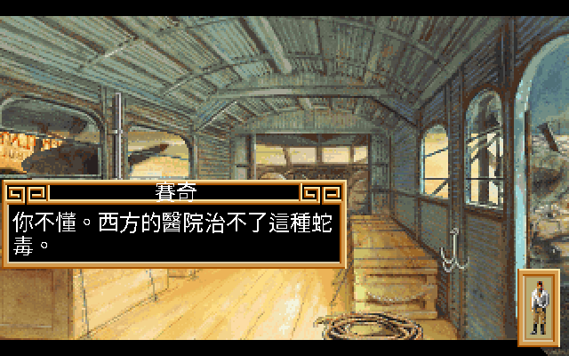
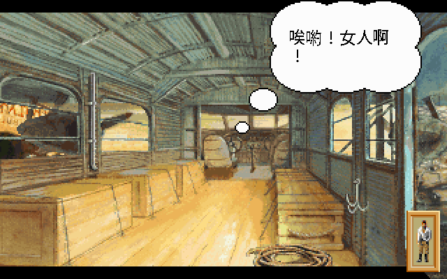
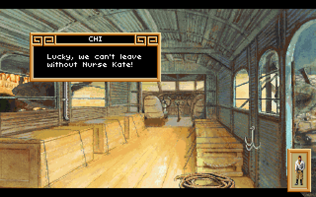
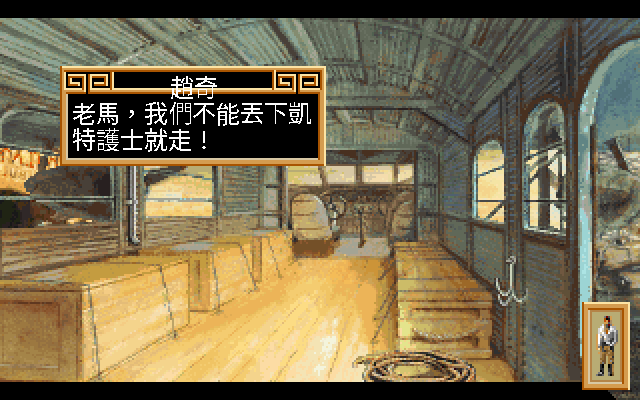
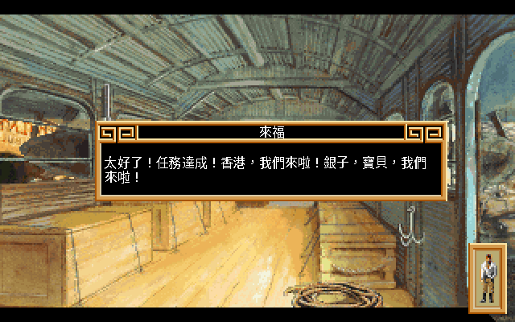
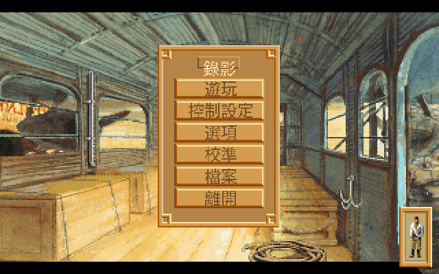

# Heart of China 繁體中文化（中國之心）

> 把 1991 年的環球冒險《Heart of China》（Dynamix / Sierra）做成可玩的**繁體中文版** —
> 透過自製 patch 的 ScummVM、真實點陣中文字、與一份逐句重譯的中文劇本。
>
> 🚧 **進行中。** 全劇本 **4,651 句**已從遊戲檔挖出（英文原版），中文化引擎機制沿用
> 姊妹作《Rise of the Dragon》已驗證的 **engine-side overlay**：真實點陣中文字
> 直接畫在遊戲畫面上，按 **F8** 即時循環 **英文 / 中文 24×24 / 中文 16×16**。

## 🎬 實機展示

> 「洋基之鷹」號機艙內 —— 來福剛把凱特救出來，正準備飛往香港。全程繁體中文、真 **24×24 點陣字**，
> 名牌、對白、思考泡泡都中文化。角色採 **1990s 軟體世界中文版說明書的官方譯名**（來福 / 賽奇 / 凱特，
> 見〈[譯名考古](#譯名考古為什麼主角叫來福忍者叫賽奇)〉）。以下截圖都是**引擎內建 autopilot 自動跑出來的**。

> 來福：「太好了！任務完成！香港，我們來啦！銀子，我們來啦！」

| 賽奇（中國忍者・對話框）| 來福（思考泡泡）|
|---|---|
|  |  |
| 賽奇：「你不懂。西方醫院治不了這種蛇毒。」| 來福心想：「唉喲！女人啊！」（thought-bubble 框型）|

**按 F8 即時循環三種顯示模式：英文（原始）→ 中文 24×24 → 中文 16×16：**

| 原版（英文） | 中文化（本專案）|
|---|---|
|  |  |
| `CHI: Lucky, we can't leave without Nurse Kate!` | `賽奇：來福，我們不能丟下凱特護士不管！` |

同一句、兩種字級（**24×24** 高解析 vs **16×16** 較貼近原排版，一行放得下）：

| 中文 24×24 | 中文 16×16 |
|---|---|
|  |  |

> ✅ **全劇本 4,651 句已翻完**（4,771 個翻譯條目、0 個非 Big5 字），民初冒險通俗派語氣。

連系統選單也整套中文化了（遊玩 / 控制設定 / 選項 / 校準 / 檔案 / 離開）：

---

## 三十年前，我在一款看不懂的遊戲裡「回到了」中國

那是 1990 年代初。14 吋 CRT 的光映在一個孩子臉上，螢幕裡是 1930 年代的香港鴉片館、
成都的軍閥城寨、加德滿都的廟宇、開往伊斯坦堡的東方快車 —— 一個美國飛行員，帶著一個
中國武術家，橫越半個地球去救一個被綁架的報業千金。遊戲叫《Heart of China》，
畫面是當年罕見的真人數位化照片，劇情又急又險。而那個孩子，連主選單都讀不順。

最弔詭的是：這是一款講「中國」的遊戲，裡頭的中國卻是用英文寫的。他看著螢幕上那座
寫著看不懂的字的城寨，在腦子裡替來福和賽奇配上一整套自己編的中文台詞。卡住了就翻
《電腦玩家》《軟體世界》《PC Game》—— 那個年代沒有 GameFAQ、沒有 wiki、沒有 Discord，
攻略是用印刷油墨換來的。

那個孩子是我。三十年後，我把當年腦補的每一句，換成真正的譯文 —— 一句一句，全劇本 4,651 句。

---

## 關於《Heart of China》

**Dynamix 開發、Sierra On-Line 發行，1991 年，Jeff Tunnell 設計**（與《Rise of the Dragon》
同一位設計師、同一套 DGDS 引擎）。

- **時間是 1930 年代，舞台橫跨半個地球。** 你是 Jake「Lucky」Masters（**來福**），
  一個落魄、嗜賭、開著一架叫「洋基之鷹」破飛機的美國冒險家。報業富賈 **羅梅士**（E.A. Lomax）雇你去
  成都，從軍閥 **鄧利**（Li Deng）的城寨裡救出他女兒 **凱特**（Kate）。你拉上了中國忍者 **賽奇**（Zhao Chi）
  當搭檔，從香港、成都，一路逃到加德滿都、印度，最後上了開往伊斯坦堡的東方快車。
- **畫面在當年是狠角色。** 跟《Rise of the Dragon》一樣，用**真人演員的數位化照片**合成
  漫畫分鏡，搭配手繪背景，像在演一部互動電影。
- **它有即時時鐘、有多重結局、會讓你死很多次** —— 並且穿插坦克、火車、街頭「三杯猜豆」
  等小遊戲。

> 資料來源：[Wikipedia](https://en.wikipedia.org/wiki/Heart_of_China_(video_game))、
> [MobyGames](https://www.mobygames.com/game/207/heart-of-china/)、
> [Dynamix Wiki](https://dynamix.fandom.com/wiki/Heart_of_China)。

---

## 譯名考古：為什麼主角叫「來福」、忍者叫「賽奇」？

1990 年代，《Heart of China》在台灣是由 **軟體世界**（早期電腦遊戲發行商的佼佼者）代理、
出了**中文版說明書**的。那本說明書裡，主角不叫「拉奇」，也不叫「傑克」——

> 「外號叫『**來福**』(Lucky)的傑克馬斯特斯(Jake Masters)……羅先生特別請了一位精明的
> **中國忍者賽奇**(Zhao Chi)來幫助來福。」——《軟體世界》中文版說明書．故事大綱

**來福**（Lucky）、**賽奇**（那位有名有姓的中國忍者）、軍閥**鄧利**（Li Deng）、報業富賈
**羅梅士**（Lomax）——這些不是我們新譯的，是**三十年前那本說明書就定好的名字**。
本專案的原則是**譯名考古**：把當年官方說明書的譯名原原本本還原，而不是另起爐灶。
所以你在遊戲裡看到的，正是 1990 年代台灣玩家手冊上的那幾個名字。

> 來源：軟體世界中文版說明書（[骨灰集散地](http://boneash.oldgame.tw)「說明書補完計劃」掃描還原；
> 文字編輯 賴旭輝）。完整譯名對照見 [`CONTEXT.md`](CONTEXT.md)。

---

## 這個專案做了什麼

ScummVM 的 `dgds` 引擎已經能執行這款遊戲，所以我們**不碰遊戲本體的執行邏輯**，
而是在 ScummVM 這一層動手腳（與《Rise of the Dragon》中文化同一套機制）：

1. **把劇本挖出來** — HOC 的對白藏在 72 個壓縮過的 `D<N>.DDS` 對白檔裡（不像前作放在場景檔）。
   我們照著 ScummVM 引擎原始碼寫了 `tools/extract_dds.py`，抽出全部 **4,651 句**英文對白。
2. **重新翻成繁體中文** — 以英文原典為準。
3. **讓引擎看得懂中文** — 替 ScummVM 加上**真實 24×24 點陣中文字**。
4. **可以切換語言** — 遊戲中按 **F8** 即時切 **英文 / 中文**。原始遊戲檔完全不動，中文是「疊」上去的。

> 你手上那份合法擁有的原版遊戲檔不會被改壞；中文是一層可開可關的外掛。

---

## 目前進度

| 階段 | 內容 | 狀態 |
|---|---|---|
| Phase 0 | 格式逆向、劇本抽取（4,651 句）、引擎基線 | ✅ 抽取完成 |
| Phase 1 | 24×24 中文字型 + 引擎渲染 PoC（中文已上畫面）| ✅ |
| Phase 2 | 翻譯 overlay + F8 語言切換（機制驗證）| ✅ |
| Phase 3 | 全量翻譯（**4,651 句對白 + 名牌 + 系統選單 + TTM**，官方軟體世界譯名，0 非 Big5）| ✅ |
| Phase 3.5 | **遊戲文案專家潤稿**（逐批校潤角色聲音/語氣，1,879 句改寫）| ✅ |
| Phase 4 | game-tester 自動截圖 QA（[報告](docs/GAME_TEST_REPORT.md)）| ✅ |
| Phase 5 | 打包 Linux / Windows / macOS | ✅ Linux(AppImage+tar.gz) ・ ✅ Windows(交叉編譯) ・ ✅ macOS(CI `.app` build 成功) |

完整工程計畫見 [`PLAN.md`](PLAN.md)、術語/譯名見 [`CONTEXT.md`](CONTEXT.md)。

---

## 版權聲明

《Heart of China》原始版權屬 **Dynamix / Sierra**（現屬其權利繼承者）。
**本專案不包含、也不重新發布任何遊戲原始檔。** 這裡所有的工具、patch、譯文、字型，
皆為衍生的中文化作品，僅供**已合法擁有原版遊戲**的玩家使用。
遊戲執行倚賴開源的 [ScummVM](https://www.scummvm.org/)。

## 致謝

- **ScummVM 團隊** — `dgds` 引擎讓這款老遊戲在現代機器上重生，也是逆向格式的權威依據。
- **Dynamix / Jeff Tunnell** — 在 1991 年就把環球冒險電影搬進遊戲。
- 繁體點陣字採用開源字型（Noto Sans CJK TC、文泉驛、AR PL UMing）rasterize 而成。
- 前作經驗：[Rise of the Dragon 繁中化](https://github.com/wicanr2/Rise-of-the-dragon-cht)。
