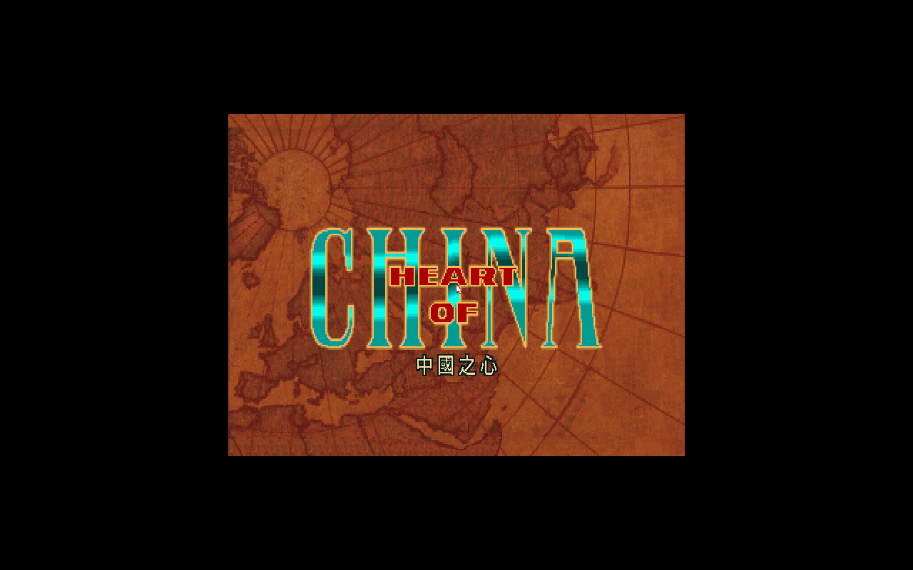
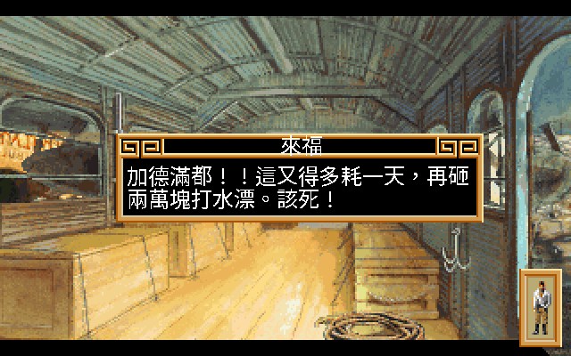
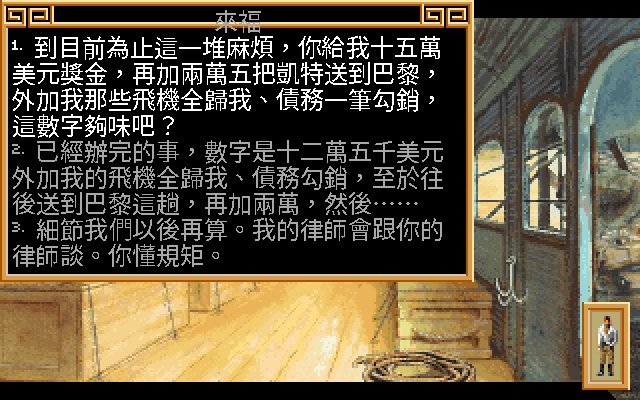
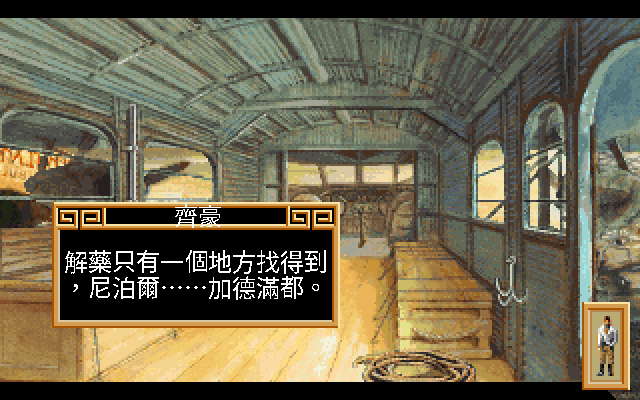

# Heart of China 繁體中文化（中國之心）

> 把 1991 年的環球冒險《Heart of China》（Dynamix / Sierra）做成可玩的**繁體中文版** ——
> 透過自製 patch 的 ScummVM、真實點陣中文字、與一份逐句重譯的中文劇本。
> 角色採 **1990s 軟體世界中文版說明書的官方譯名**（來福 / 齊豪 / 凱蒂），不是另起爐灶的新譯。
>
> ✅ 全劇本 **4,651 句**對白 + 名牌 + 系統選單全中文化，按 **F8** 即時循環
> **英文 / 中文 24×24 / 中文 16×16**。Linux / Windows / macOS 三平台都能跑。

---

## 目錄

- [三十年前，我在一款看不懂的遊戲裡「回到了」中國](#致詞)
- [實機展示](#實機展示)
- [關於《中國之心》：一封從 1930 年代寄來的信](#關於中國之心)
- [三個人，半個地球：角色與旅程](#角色與旅程)
- [這遊戲會讓你死很多次：玩法、時鐘與多重結局](#玩法)
- [坦克、車頂、猜豆子：那三段讓你手心冒汗的小遊戲](#小遊戲)
- [譯名考古：為什麼主角叫「來福」、忍者叫「齊豪」？](#譯名考古)
- [Technical Deep Dive：中文是怎麼疊上去的](#technical)
- [目前進度](#進度)
- [這在 1990 年代要做多久？（COCOMO 估算）](#成本)
- [版權聲明與致謝](#版權致謝)

---

## 三十年前，我在一款看不懂的遊戲裡「回到了」中國

那是 1990 年代初。14 吋 CRT 的微光映在一個孩子的臉上，螢幕裡是 1930 年代的香港鴉片館、
成都的軍閥城寨、加德滿都的廟宇、開往伊斯坦堡的東方快車 —— 一個美國飛行員，帶著一個
中國武術家，橫越半個地球去救一個被綁架的報業千金。遊戲叫《Heart of China》，
畫面是當年罕見的真人數位化照片，劇情又急又險。而那個孩子，連主選單都讀不順。

最弔詭的是：這是一款講「中國」的遊戲，裡頭的中國卻是用英文寫的。他盯著螢幕上那座
寫滿看不懂的字的城寨，在腦子裡替來福和齊豪配上一整套自己編的中文台詞。卡住了就翻
《電腦玩家》《軟體世界》《PC Game》—— 那個年代沒有 GameFAQ、沒有 wiki、沒有 Discord，
攻略是用印刷油墨換來的，書局架上那本厚厚的軟體世界中文版說明書，是唯一的浮木。

那個孩子是我。三十年後，我把當年腦補的每一句，換成真正的譯文 —— 一句一句，全劇本
4,651 句。這份 README 你可以三層讀：想直接看成果，跳到下面的[實機展示](#實機展示)；
想當複習，慢慢讀完每一章；想知道中文是怎麼釘進三十年前的執行檔的，翻到最後的
[Technical Deep Dive](#technical)。

---

## 🎬 實機展示

講完開場白，先讓眼睛看一輪。下面所有截圖都是**引擎內建 autopilot 自動跑出來的**，
不是 PS 合成 —— 真 **24×24 點陣字**直接畫在 1991 年的遊戲畫面上，名牌、對白、思考泡泡
全中文化。

**片頭標題**：英文 "HEART OF CHINA" logo 下疊上金字中文副標「中國之心」（描深邊、置中於古地圖銅色帶；
引擎偵測那一拍才畫，不擾動前一拍遊戲原生的毛筆中國之心）：

「洋基之鷹」號機艙內，來福剛把凱蒂救出來，正準備飛回香港領賞：

> 來福：「太好了！任務達成！香港，我們來啦！銀子，寶貝，我們來啦！」

老玩家絕對記得，這遊戲的對白框會隨角色換框型 —— 講話的人用實線方框，心裡碎念的用
思考泡泡。兩種都得吃中文，缺一個就破功：

| 齊豪（中國忍者・對話框）| 來福（思考泡泡）|
|---|---|
|  |  |
| 齊豪：「你不懂。西方的醫院治不了這種蛇毒。」| 來福心想：「唉喲！女人啊！」（thought-bubble 框型）|

**按 F8 即時循環三種顯示模式 —— 英文（原始）→ 中文 24×24 → 中文 16×16：**

| 原版（英文） | 中文化（本專案）|
|---|---|
|  |  |
| `CHI: Lucky, we can't leave without Nurse Kate!` | 齊豪：「來福，我們不能就這樣丟下凱蒂護士不管！」 |

24×24 是高解析、看得清楚；16×16 比較貼近原版排版，一行常常就放得下。同一句，兩種字級任你選：

| 中文 24×24 | 中文 16×16 |
|---|---|
|  |  |

最讓人崩潰的老問題是**對白溢出框外**：24px 的中文比原版英文小字高一截，碰到三個長
選項的談判畫面，文字直接撐破對話框下緣。我們讓引擎在繪製前先數**換行後的中文行數**，
把對話框往下長到剛好容納（齊豪那段加德滿都的轉折、來福多選項談判，都是這樣救回來的）：

| 來福講加德滿都 | 來福三選項談判（框自動長高）|
|---|---|
|  |  |

連系統選單都整套中文化了 —— 遊玩 / 控制設定 / 選項 / 校準 / 檔案 / 離開：

看完畫面，接下來講講這款遊戲到底在演什麼。

---

## 📜 關於《中國之心》：一封從 1930 年代寄來的信

**Dynamix 開發、Sierra On-Line 發行，1991 年，Jeff Tunnell 設計** —— 跟前作《Rise of the
Dragon》（軟體世界當年譯作《城市獵人》）同一位設計師、同一套 DGDS 引擎。1991 年的軟體世界
中文版說明書，故事大綱是這樣開頭的：

> 故事發生在一次世界大戰後的中國，地點在四川成都附近。一位美國商業鉅子羅梅士（Lomax）
> 的女兒凱蒂（Kate）在成都附近的鄉下當護士，卻在偶然的機會中被成都的軍閥鄧利（Li Deng）
> 看上，而加以俘擄。
> ——《軟體世界》中文版說明書．壹、故事大綱

羅梅士懸賞重金救女，卻沒人敢動。逼到絕境，他找上了一次大戰的空戰英雄、外號「來福」
的傑克馬斯特斯 —— 一個戰後開運輸公司卻經營不善、把飛機全抵押給羅梅士的落魄飛行員。
條件很硬：救出凱蒂就還飛機、再給大筆酬金，酬金從 **$200,000** 起跳，**晚一天救出去就少 $20,000**。
這不只是劇情設定，是貫穿全程、滴答作響的即時時鐘 —— 你拖一天，獎金就蒸發兩萬。

當年軟體世界的盒裝廣告文案，是這麼吹的（一字不改，連錯字都是那個年代的味道）：

> 「一部又絕對無法抗拒的曠世鉅作！你……即將面臨破產邊緣的年輕空戰英雄！未知的命運
> 將你們三人結合起來，捲進一場驚彩刺激、浪漫旖旎的跨國冒險行動。」

這段文案沒在唬人。畫面在當年是狠角色 —— 跟《城市獵人》一樣，用**真人演員的數位化照片**
合成漫畫分鏡，搭手繪背景，像在演一部互動電影。需求配備寫得清清楚楚：VGA、硬碟、AT 機種、
640K RAM、外加一張 Sound Blaster（說明書原話：「少了它，遊戲樂趣將減半」）。
那是一張 1.2M 磁片要灌七片、印刷油墨還沒乾的年代。

> 資料來源：[Wikipedia](https://en.wikipedia.org/wiki/Heart_of_China_(video_game))、
> [MobyGames](https://www.mobygames.com/game/207/heart-of-china/)、
> [Dynamix Wiki](https://dynamix.fandom.com/wiki/Heart_of_China)、軟體世界中文版說明書。

故事講完了，但這趟旅程真正的重量，在三個跟你綁在一起的人身上。

---

## 🧭 三個人，半個地球：角色與旅程

這遊戲最妙的地方，是你不是只操作來福一個人 —— 劇情會讓你在來福、齊豪、凱蒂之間切換主控，
而且每個角色開口的腔調都不一樣。我們的潤稿就是衝著這點去的：來福一張嘴痞氣賤兮兮，
齊豪是中國忍者的簡潔武人腔，凱蒂機伶，軍閥鄧利則是一句話壓死人的威壓。先認認這幾位狠角色：

| 角色 | 英文 | 官方軟體世界譯名 | 出場 | 是何方神聖 |
|---|---|---|---|---|
| 主角 | Lucky / Jake Masters | **來福** | 1513 句 | 落魄、嗜賭、開著破飛機「洋基之鷹」號的美國冒險飛行員。全名傑克馬斯特斯。 |
| 搭檔 | Zhao Chi | **齊豪** | 552 句 | 欠羅梅士人情的**中國忍者**，來福的左右手，講話帶武人腔。 |
| 千金 | Kate Lomax | **凱蒂** | 552 句 | 被綁架的報業千金，在鄉下當護士，後來成了戀人。 |
| 金主 | E.A. Lomax | **羅梅士** | 139 句 | 凱蒂之父，美國報業富賈，出錢的人。 |
| 反派 | Li Deng | **鄧利**（軍閥）| 18 句 | 盤據四川成都的軍閥，把凱蒂擄走的那位。姓鄧名利。 |

故事從香港的碼頭開始 —— 來福得先在何氏茶樓和吳夫人的中藥店之間穿梭，說服那個「不相信
飛機能飛上天」的齊豪入夥（沒錯，說明書真的這樣寫）。湊齊兩人，登上洋基之鷹號，航線
一路往內陸：**香港 → 成都**（軍閥城寨救人）**→ 加德滿都**（尼泊爾，齊豪那句「解藥只有
一個地方找得到」就指這裡）**→ 印度 → 搭東方快車到伊斯坦堡**。

| 齊豪：尼泊爾的解藥 |
|---|
|  |
| 「解藥只有一個地方找得到，尼泊爾……加德滿都。」|

值得一提的是，這趟旅程還有條暗線 —— 飛行畫面左下角有個**愛情指標**，標記凱蒂對來福的
感覺，分熱情 / 普通 / 冷淡三檔。你選的每句話不只改劇情走向，也在悄悄加減這顆心的溫度。
說明書講得很白：「最好的結局，就是來福順利把凱蒂救到（巴黎），又贏得了戀人的芳心。」
這份溫情藏在硬漢冒險底下，正是 Jeff Tunnell 的招牌。講完角色，該講講這遊戲有多會整人了。

---

## ⏱️ 這遊戲會讓你死很多次：玩法、時鐘與多重結局

老玩家都記得 Dynamix 這套引擎的脾氣：它不會牽著你走。1991 年的說明書在〈故事流程〉
那章寫得語重心長 —— 「在多種可能的發展中，只有少數最艱辛的會讓你平安地到達」終點，
而且「你沒嘗試前，絕對不會知道會有什麼樣的發展」。翻成白話：**這遊戲會讓你死很多次**，
而且常常死得莫名其妙，等你回神才發現三關之前選錯了一句話。

幾條讓當年玩家又愛又恨的核心機制：

1. **滴答作響的酬金鐘** —— 從 $200,000 起算，每拖一天少 $20,000。畫面下方那個一直往下跳的
   數字，是這遊戲最殘酷的設計：你不是在跟軍閥賽跑，是在跟自己的荷包賽跑。
2. **歧路警告（plot branch）** —— 地圖上的十字路牌，提醒你「這個點可能通往完全不同的結局」。
   走進死胡同時，老玩家就靠這些路牌回頭重試。
3. **故事的同時性** —— 不管你在不在場，世界各地的事照樣發生。遊戲會冷不防中斷，用一段
   過場動畫告訴你「與此同時」別處出了什麼事（沒錯，就是那句 `MEANWHILE`）。
4. **禍從口出** —— 說明書原話：「一句不該說的話，可就會使你失去某些達成遊戲的線索與契機。」
   NPC 會記得你說過的每句話，三選一的對話選項是真的有後果的。

當年沒有 wiki、沒有自動存檔的概念，玩這款遊戲的鐵則就是 **F5 存好存滿**（說明書說一個目錄
最多塞 20 個進度）。你會在成都的城寨團滅、會在某句嘴賤對白後被吳夫人轟出門、會因為拖太久
讓酬金縮水到救出人也救不了公司。這些「死法」不是 bug，是設計 —— 而現在，每一句讓你死得
不明不白的對白，總算是看得懂的中文了。卡關時最考驗指揮能力的，往往不是解謎，是那幾段
突然切換成動作模式的小遊戲。

---

## 🎮 坦克、車頂、猜豆子：那三段讓你手心冒汗的小遊戲

文字冒險玩到一半，Dynamix 冷不防塞給你動作場面。說明書貼心地說「你還是可以選擇要不要
參加這二個小插曲」—— 但老玩家都知道，沒人忍得住不玩。ScummVM 的 dgds 引擎也原生支援
這幾段（`china_tank`、`china_train`、`shell_game`），中文化照樣覆蓋到：

| 小遊戲 | 場景 | 你要幹嘛 | 翻車點 |
|---|---|---|---|
| **坦克歷險** | 成都軍閥城寨 | 先轉鑰匙、按發動鈕發動坦克，再前進 / 轉彎 / 開砲 | 鑰匙得在劇情正確流程裡先撿到，不然你連發動都發動不了 |
| **東方快車車頂決鬥** | 開往伊斯坦堡的火車頂 | 在生命力 / 疲勞 / 殘忍三條狀態條間拿捏，攻擊 / 閃避 / 撤退 / 休息 | 疲勞一高攻擊就沒力，硬拚只會被打趴在飛馳的車頂上 |
| **三杯猜豆** | 街頭賭局 | 盯著三個杯子追那顆豆子 | 嗜賭的來福碰上老千，手氣不好直接燒掉你寶貴的銀子 |

這三段是整個冒險的腎上腺素開關。坦克那段的控制面板、車頂決鬥那條會見血的生命力橫條、
街頭騙子翻杯子的速度 —— 在 1991 年的 320×200 畫面上，配上 Sound Blaster 的音效，緊張感
是實打實的。中文化沒漏掉它們：狀態條的提示、控制面板的標籤、賭局的對白，全都換成了
看得懂的字。動作場面講完了，回到這份專案最較真的一件事 —— 名字。

---

## 🔍 譯名考古：為什麼主角叫「來福」、忍者叫「齊豪」？

校對劇本是字面工作，還原譯名則是另一個維度的考古。1990 年代，《Heart of China》在台灣
是由**軟體世界**代理、出了中文版說明書的。翻開那本說明書的〈故事大綱〉，主角不叫「拉奇」
也不叫「傑克」——

> 「外號叫『**來福**』(Lucky) 的傑克馬斯特斯 (Jake Masters)……羅先生特別請了一位欠他情的
> **中國忍者齊豪** (Zhao Chi) 來幫助來福。」——《軟體世界》中文版說明書．壹、故事大綱

那本說明書裡，主角是**來福**（Lucky）、他的搭檔是中國忍者**齊豪**（Zhao Chi）、被擄走的
報業千金是**凱蒂**（Kate）、她父親是富賈**羅梅士**（Lomax）、擄人的軍閥是**鄧利**（Li Deng）。
這五個名字，**三十年前那本說明書就定好了** —— 不是音譯成「拉奇」「凱特」那種一看就是後人新補的
譯法，而是帶著民初味、一看就知道是當年那批譯者手筆的名字。

本專案的原則是**譯名考古**：把當年官方說明書的譯名原原本本還原，而不是另起爐灶重譯。那是一個
翻譯者手邊沒有 Google、靠聽寫與語感替外國人名音譯的年代；我們不去「訂正」它，而是把它當文物
保存。所以你在遊戲裡看到的這幾個名字，不是 2026 年新譯的，是 1990 年代台灣玩家手冊上、油墨
印著的那幾個。這是一封寫給同代人的信，名字當然得是當年那幾個。

> 來源：軟體世界中文版說明書〈壹、故事大綱〉（[骨灰集散地](http://boneash.oldgame.tw)
> 「說明書補完計劃」掃描還原；文字編輯 賴旭輝）。完整譯名對照見 [`CONTEXT.md`](CONTEXT.md)。

考古講完了，最後一章交給工程師 —— 中文到底是怎麼疊進這個三十年前的執行檔的。

---

## 🧩 Technical Deep Dive：中文是怎麼疊上去的

以下為工程文件區，voice 與上面的雜誌主體無關。核心架構決策與姊妹作
[Rise of the Dragon CHT](https://github.com/wicanr2/Rise-of-the-dragon-cht) 一致：**engine-side
overlay，不破壞性注入**。原始遊戲檔完全不動；中文是 ScummVM 繪字當下查譯文表、改用 CJK 字型
疊上去的一層，按 F8 可開可關。

### 1. 劇本抽取（與 ROTD 的關鍵差異）

HOC 的玩家可見對白不像前作放在場景檔（SDS）裡，而是封在 **72 個壓縮過的 `D<N>.DDS`** 對白檔中，
由 `Scene::loadDialogData` 載入（SDS version `1.216`，≥1.214 起改由 DDS 載對白）。每一筆對白的
查鍵是 **`(fileNum, num)`** —— 這是與 ROTD（key 為 `scene:num`）最大的差異。

| 項目 | ROTD | HOC |
|---|---|---|
| Volume 索引 | `VOLUME.VGA` | `VOLUME.RMF`（同格式）|
| SDS 版本 | `1.211` | `1.216` |
| **對白存放** | inline SDS，key `scene:num` | **72 個 `D<N>.DDS`**，key `(fileNum, num)` |
| 對白量 | 2,386 句 | **4,651 句** |
| UI 檔 | `*.req` | `hinv.req` / `hvcr.req` / `hoc.rst` |

`tools/extract_dds.py` 照 ScummVM 引擎原始碼解 RMF 索引 + chunk + RLE/LZW 解壓，抽出全部
4,651 句英文對白（0 失敗）。對白鍵在 patch 裡做成 game-agnostic：`dialog.cpp drawForeground`
用 `_fileNum ? _fileNum : sceneNum`，讓同一個 binary 通吃 HOC（走 DDS fileNum）與 ROTD（走 scene）。

### 2. 三條繪字路徑（漏一條就有英文殘留）

中文要全覆蓋，必須同時攔三條獨立的繪字路徑：

- **① 對白內文** —— `dialog.cpp drawForeground`，行以 `\r` 分隔。
- **② 名牌 / 選單 / REQ 標題** —— `request.cpp drawHeader` 走 `lookupUI`。
- **③ TTM 畫面文字** —— `ttm.cpp` 內 `TT3:` 的 `drawString`（電腦 / 電報 / 站名等）。HOC 僅 1 條
  （`ftank3s.ttm` 的 `MEANWHILE` → 「與此同時」）。

對話框框型也分兩種（border `drawType2` / thought bubble `drawType3`），都要吃中文；
talking-head 視訊臉 sprite 覆蓋區的 CJK overlay 要即時清除，名牌才不會浮在頭像上。

### 3. CJK 字型、F8 與溢出修正

- **字型**：24×24 與 16×16 雙位元組 Big5 點陣字，自 Noto Sans CJK TC 等開源字型 rasterize
  （`build_cjk_font.py`，各 13,709 glyphs）→ `hoc_zh24.dcjk` / `hoc_zh16.dcjk`。
- **F8 切換**：dgds keymap 自訂動作，循環 `_avail` = 英文 → 中文 24 → 中文 16，即時重繪。
  HOC 無德文 `de.dtr`，`cycleMode` 自動略過。
- **溢出修正**：`dialog.cpp drawType2` 在繪製前依**換行後的 CJK 行數**把 `_rect.height` 往下長到
  剛好容納（clamp 在 320×200 螢幕底）。配合資料層把 190 條編號選項清單的 `\r\r` 收斂成 `\r`，
  消除選項間多餘空行。3 長選項在 24×24 下完整收進框（`screenshots/showcase_zh_options.png`）。

### 4. 翻譯打包與 QA

- **產物**：`zh.json`（UTF-8 譯文）→ `build_translation.py` → `zh.dtr`（DTRN 格式，Big5，228KB）；
  引擎改動全收斂在 `patches/dgds-cjk.patch`。
- **全量**：4,651 句對白 + 名牌 + 系統選單 + TTM，合計 **4,832 個翻譯條目、0 個非 Big5 字、0 缺字**。
- **潤稿**：46 批 multi-agent 在機翻之上做在地化 review，依官方手冊劇情脈絡 + 角色聲音 + 軟體世界
  語感，**1,879 句改寫**（來福痞氣 / 齊豪武人腔 / 凱蒂機伶 / 鄧利軍閥威）。
- **QA**：`game_tester.py` 驅動引擎 autopilot（op：`scene N` / `dlg F:N` / `menu` / `lang 0|1|2` /
  `shot` / `quit`），逐項截圖驗證，報告見 [`docs/GAME_TEST_REPORT.md`](docs/GAME_TEST_REPORT.md)。

### 5. 三平台打包

- **Linux**：`package_linux.sh` → relocatable bundle + `tar.gz`（28M）；`package_appimage.sh`
  → `Heart-of-China-CHT-x86_64.AppImage`（27M）。
- **Windows**：`build_windows.sh`（Docker mingw 交叉編譯 dgds）→ `scummvm.exe` + SDL2.dll + 資產 +
  `.bat` → `hoc-cht-windows-x86_64.zip`（12M）。exe 靜態連 C++ runtime，wine 下驗證通過。
- **macOS**：`.github/workflows/build.yml`（macos-14 runner clone ScummVM `f4526cf` + 套 patch +
  dylibbundler `.app`），CI build 成功，artifact `hoc-cht-macos`。

> 本 repo 只放工具、patch、譯文、字型、文件，**不含遊戲本體**。dist/ 產物（含 / 不含遊戲）
> 皆 gitignore，不發布。完整工程計畫見 [`PLAN.md`](PLAN.md)、術語表見 [`CONTEXT.md`](CONTEXT.md)。

---

## ✅ 目前進度

| 階段 | 內容 | 狀態 |
|---|---|---|
| Phase 0 | 格式逆向、劇本抽取（4,651 句）、引擎基線 | ✅ |
| Phase 1 | 24×24 中文字型 + 引擎渲染 PoC | ✅ |
| Phase 2 | 翻譯 overlay + F8 語言切換 | ✅ |
| Phase 3 | 全量翻譯（對白 + 名牌 + 系統選單 + TTM，4,832 條目，0 非 Big5）| ✅ |
| Phase 3.5 | 遊戲文案專家潤稿（1,879 句改寫）| ✅ |
| Phase 4 | game-tester 自動截圖 QA（[報告](docs/GAME_TEST_REPORT.md)）| ✅ |
| Phase 5 | 打包：Linux（AppImage+tar.gz）・Windows・macOS（CI `.app`）・**Android**（CI APK + 本地注入）| ✅ 五平台 |

---

## 🛠️ 這在 1990 年代要做多久？（COCOMO 開發成本估算）

用經典 **COCOMO Basic**（`工作量 PM = a·KLOC^b`）反推「這套東西**用傳統方式**要多少人力」，再對照
**2026 年 AI-agent 工具棧**的實際投入。**只算程式碼**（引擎 patch + 工具 + 打包腳本）；翻譯與文件另列。

| 類別 | 模式 | 有效碼行 | COCOMO 工作量 |
|---|---|---|---|
| 引擎 CJK overlay patch（C++）| Embedded（逆向格式、跨 dgds 模組）| 814 | 2.81 PM |
| 工具 + 三平台打包腳本（Python / sh）| Semi-detached（混合熟悉度、跨平台）| 968 | 2.89 PM |
| **程式碼小計** | | **1,782（1.78 KLOC）** | **≈ 5.7 PM** |
| 譯文（4,832 條目 / ~9.3 萬漢字）| —（翻譯產出，不計入 COCOMO）| — | 另計 |
| 文件 / 說明書轉錄（Markdown）| —（不計入）| ~580 | — |

COCOMO 結果（程式碼 1.78 KLOC）：**約 5.7 人月、工期 ~4.4 個月、並行 ~1.3 人（≈ 0.5 人年）**。

**兩個系統性偏差（誠實揭露）**：
- **COCOMO 低估**：抓不到「0 行卻最燒時間」的工作 —— 逆出 DDS 1.216 格式、讀 ScummVM 引擎、
  逐張點陣截圖目視驗證、譯名考古、TTM 持久層與對話框溢出 debug。逆向/漢化是典型「低 SLOC、每行高心智」。
- **COCOMO 高估**：它校準自 1980s **團隊全生命週期**開發**新應用**，內含 meeting / spec / regression
  的 overhead，本案是單人 + 大量拋棄式腳本，沒有那層。
- 兩者部分相抵 → 把 **~5.7 人月**當「**傳統人力合理上界**」，不是實際工時。

**三個數字並陳**：

| 視角 | 人力 |
|---|---|
| COCOMO 教科書（Embedded+Semi, 1.78 KLOC）| **≈ 5.7 人月（~0.5 人年）** |
| 資深工程師單幹、無 AI（扣團隊 overhead；含逆向 + 4,651 句翻譯 + 三平台打包）| **≈ 2–4 人月** |
| **2026 實際（AI agent + 人主導測試）** | **約 1 天 wall-clock、~0.05 人月** |

> **一句話**：純按行數，COCOMO 喊「**約半個人年**」——那是「用 1990s 方式硬幹的等效規模」；在 2026
> AI-agent 工具棧下，含**全劇本 4,651 句翻譯**，實際壓到 **一天之內**完成。而那 4,651 句，當年那個
> 趴在 14 吋 CRT 前看不懂的孩子，是用三十年的腦補慢慢「翻」完的。這次，一天。

> *(SLOC 由 `*.py / *.sh / patch 內 C++` 去空行去純註解統計；COCOMO 採教科書 Basic 係數
> Embedded a=3.6 b=1.20、Semi-detached a=3.0 b=1.12。)*

---

## ⚖️ 版權聲明與致謝

《Heart of China》原始版權屬 **Dynamix / Sierra**（現屬其權利繼承者）。
**本專案不包含、也不重新發布任何遊戲原始檔。** 這裡所有的工具、patch、譯文、字型，皆為衍生
的中文化作品，僅供**已合法擁有原版遊戲**的玩家使用。遊戲執行倚賴開源的
[ScummVM](https://www.scummvm.org/)。

致謝：

- **ScummVM 團隊** —— `dgds` 引擎讓這款老遊戲在現代機器上重生，也是逆向格式的權威依據。
- **Dynamix / Jeff Tunnell** —— 在 1991 年就把一部環球冒險電影搬進了遊戲。
- **軟體世界** —— 1990s 台灣的中文版發行與說明書，本專案的譯名與劇情脈絡全本於此。
- **骨灰集散地「說明書補完計劃」**（文字編輯 賴旭輝、美工編輯 李孟花）—— 掃描還原了那本
  油墨早乾的說明書，這份譯名考古才有依據。
- 繁體點陣字採用開源字型（Noto Sans CJK TC、文泉驛、AR PL UMing）rasterize 而成。
- 前作經驗：[Rise of the Dragon 繁中化](https://github.com/wicanr2/Rise-of-the-dragon-cht)。
